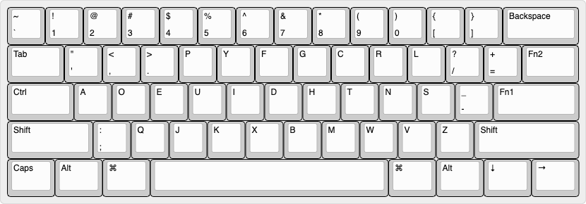
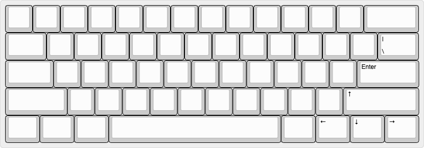
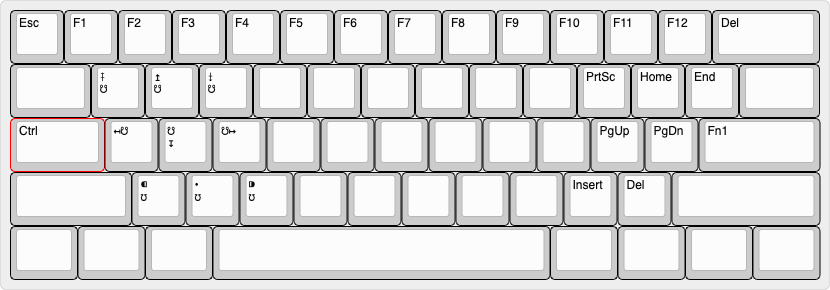
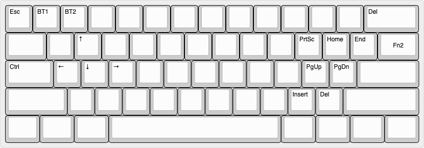

> JSON files for http://www.keyboard-layout-editor.com .

We have four layers.

Default



Tap



Fn1


Fn2



## How to use

Download or Clone the [AnnePro2-Tools]() project.

1. Build the bin file using `c18:dovrak`

    ```bash
    SKIP_FLASHING_SUPPORT=1 ./util/docker_build.sh annepro2/c18:dvorak
    ```

    This would generate a file `annepro2_c18_dvorak.bin` in the Repo Root folder.


2. Use the [annepro2_tools](./annepro2_tools) from [AnnePro2-Tools](https://github.com/OpenAnnePro/AnnePro2-Tools). This tool is the artifact for [a13b82c](https://github.com/OpenAnnePro/AnnePro2-Tools/commit/a13b82c362e928f4f867cb47d3644e07768b40a8).

    Or if you want to compile it from source, just clone [AnnePro2-Tools](https://github.com/OpenAnnePro/AnnePro2-Tools) and run `cargo build --release`. The compiled tool should be in `./target/release/annepro2_tools`.

3. Keyboard in DFU/IAP mode

    Unplug the keyboard, then holding `Esc` while plugging it back in, the keyboard now should be in DFU/IAP mode.

4. Flashing

    ```bash
    annepro2_tools annepro2_c18_dvorak.bin
    ```

    Using tool from step 1 to flash the bin file from step 2 to the keyboard.

5. Test the keycode on https://keypress.io/.

## Acknowledgements

[OpenAnnePro](https://openannepro.github.io/)
